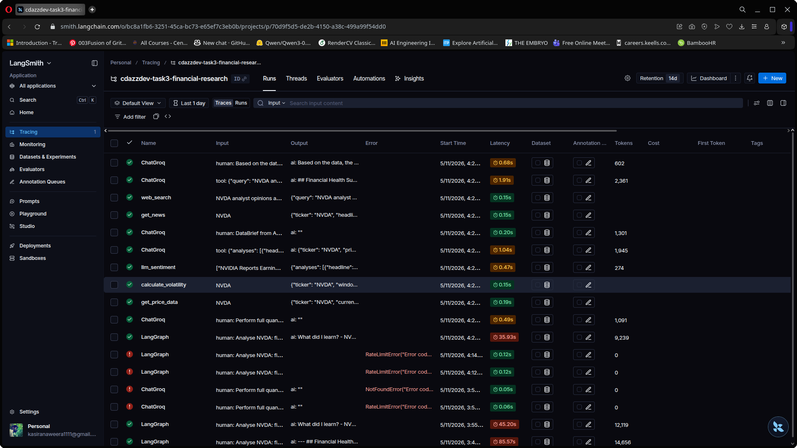

# Task 3 — Multi-Agent Financial Research System

[](https://colab.research.google.com/github/YOUR_USERNAME/CDAZZDEV-MLE-YourName/blob/main/task3_agentic/CDAZZDEV_Task3_Agentic_Workflows.ipynb)
[](https://python.org)
[](https://github.com/langchain-ai/langgraph)
[](https://console.groq.com)
[](https://smith.langchain.com)

> **CDAZZDEV Senior ML Engineer Assessment — Task 3 | Agentic Workflows**

---

## Overview

A production-grade multi-agent financial research system that autonomously analyses a stock ticker, coordinates two specialised AI agents, and produces a structured investment research report — complete with memory, observability, and a live Streamlit trace dashboard.

**Query:**

> _"Analyse the current financial health and market sentiment of [TICKER]. Identify the top three risks to its share price over the next 90 days and suggest one data-driven hedge strategy."_

---

## Architecture

- **Task 3A** — Single LangGraph ReAct agent with all 5 tools; autonomous observe → reason → act loop producing a 3-section report.
- **Task 3B** — Two-agent pipeline: Agent A (Data Analyst) → `DataBrief` (Pydantic) → Agent B (Research Writer), with a critique/clarification loop and `FinalReport` output.
- **Task 3C** — Short-term session memory, persistent JSON cache (`research_cache/`), `agent_trace.jsonl` logging, Streamlit dashboard, and LangSmith tracing.

---

## Tools

| Tool                   | Purpose                                             | Agent |
| ---------------------- | --------------------------------------------------- | ----- |
| `get_price_data`       | yfinance OHLCV + SMA, RSI, MACD, Bollinger, PE, YTD | A, 3A |
| `calculate_volatility` | Annualised vol, regime, beta vs SPY                 | A, 3A |
| `llm_sentiment`        | Groq LLaMA-3 per-headline sentiment + aggregate     | A, 3A |
| `get_news`             | Yahoo Finance headlines                             | B, 3A |
| `web_search`           | DuckDuckGo search                                   | B, 3A |

---

## Stack

| Component         | Library / Service                                           |
| ----------------- | ----------------------------------------------------------- |
| LLM               | **Groq** `llama-3.3-70b-versatile` / `gpt-4o-mini` fallback |
| Framework         | **LangGraph** `create_react_agent` (3A) · custom ReAct (3B) |
| Tool restriction  | `llm.bind_tools()` — schema-level enforcement               |
| Structured output | **Pydantic v2**                                             |
| Financial data    | **yfinance**                                                |
| Web search        | **duckduckgo-search**                                       |
| Observability     | `agent_trace.jsonl` + **LangSmith** + **Streamlit**         |

---

## Repository Structure

```
task3_agentic/
├── CDAZZDEV_Task3_Agentic_Workflows.ipynb   ← main notebook
├── dashboard.py                              ← Streamlit dashboard
├── README.md
├── logs/
│   └── agent_trace.jsonl
├── research_cache/
│   └── NVDA_2026-05-11.json
└── screenshots/
    ├── dashboard_screenshot.png
    └── langsmith_trace.png
```

---

## How to Run

### Prerequisites

- **Groq API key** (free) — [console.groq.com](https://console.groq.com)
- **LangSmith API key** (optional) — [smith.langchain.com](https://smith.langchain.com)

### Google Colab

1. Open via the badge above
2. Add secrets (🔑 sidebar): `GROQ_API_KEY`, `LANGSMITH_API_KEY` (optional), `NGROK_AUTHTOKEN` (optional)
3. **Run All** — cells 1→16

### Change ticker

```python
TICKER = "NVDA"   # ← change in Cell 11
```

Re-run Cell 11 with the same ticker to demo persistent cache.

---

## Key Design Decisions

- **LangGraph for 3A, custom loop for 3B** — `create_react_agent` for single-agent; custom `_react_loop()` for explicit critique loop control in multi-agent.
- **`bind_tools()` for tool restriction** — schema-level enforcement, not prompt-level.
- **Pydantic `DataBrief` as inter-agent contract** — validates Agent A output before handoff.
- **Incremental trace writing** — append-on-each-call ensures crash resilience.

---

## Bonus — Observability

### Streamlit Dashboard

Reads `agent_trace.jsonl` and displays KPIs, duration charts, tool distribution, timeline, and expandable trace rows.

```bash
streamlit run dashboard.py
```



### LangSmith

Auto-traces all LLM calls to project `cdazzdev-task3-financial-research`.


---

## Limitations

- **Groq rate limits**: `time.sleep(2)` between tasks on free tier.
- **yfinance schema variability**: defensive `.get()` chains.
- **DuckDuckGo timeouts**: structured error with `fallback_hint`.
- **LLM JSON compliance**: markdown fence stripping guard.

---

## Submission Checklist

- [x] Notebook outputs visible
- [x] `agent_trace.jsonl` in `logs/`
- [x] `dashboard.py` committed
- [x] `CITATIONS.md` + `REFLECTION.md` at repo root
- [x] No API keys committed
- [x] Repository is public
- [ ] `screenshots/dashboard_screenshot.png`
- [ ] `screenshots/langsmith_trace.png`
